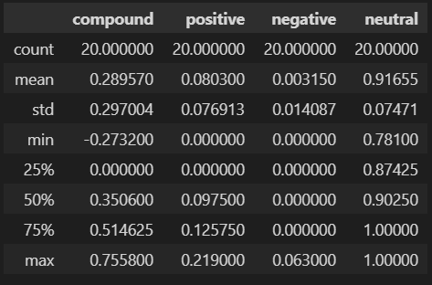
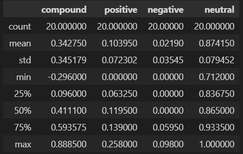
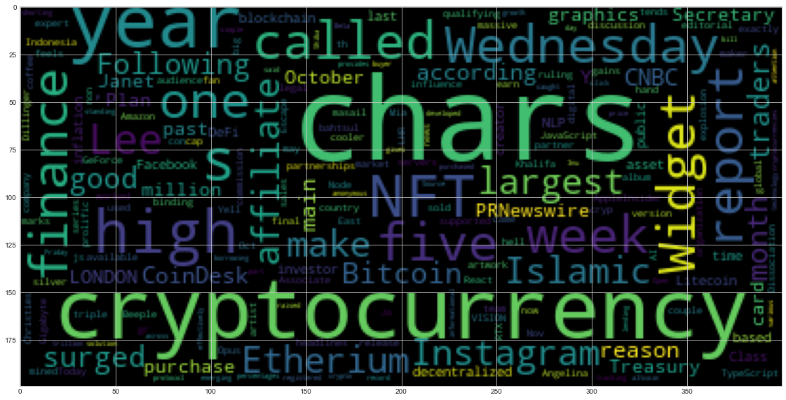
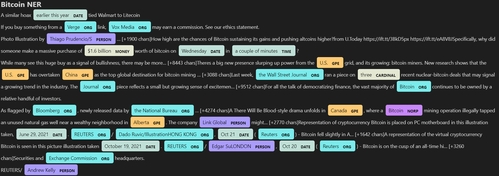
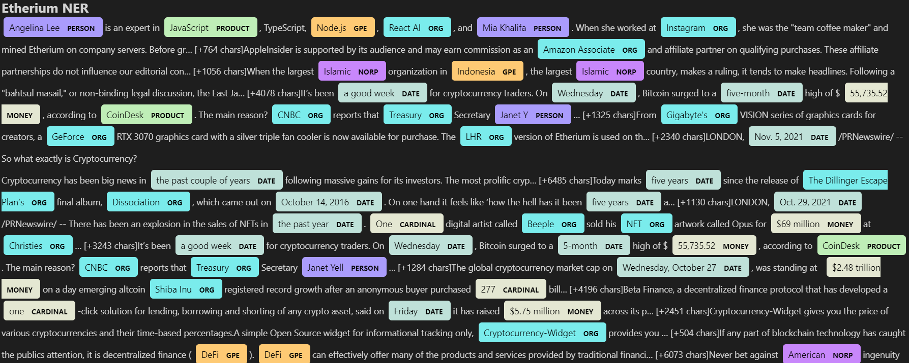

# tales_from_the_crypto
There's been a lot of hype in the news lately about cryptocurrency, so I want to take stock, so to speak, of the latest news headlines regarding Bitcoin and Ethereum to get a better feel for the current public sentiment around each coin. In this assignment, I will apply natural language processing to understand the sentiment in the latest news articles featuring Bitcoin and Ethereum. I will also apply fundamental NLP techniques to better understand the other factors involved with the coin prices such as common words and phrases and organizations and entities mentioned in the articles.

Complete the following tasks:

## 1. Sentiment Analysis
### Bitcoin Sentiment

### Etherium Sentiment

### Questions:

Q: Which coin had the highest mean positive score?

A: The highest mean positive score was Etherium with a total of 0.10395.

Q: Which coin had the highest compound score?

A: The highest (max) compound score was Etherium again with a total of 0.88850, its mean compound score of 0.34275.

Q. Which coin had the highest positive score?

A: Etherium had the highest (max) positive score coming in at 0.258, its mean positive score of 0.10395.

## 2. Natural Language Processing
### Bitcoin Wordcloud

### Etherium Wordcloud

## 3. Named Entity Recognition

### Bitcoin NER

### Etherium NER

